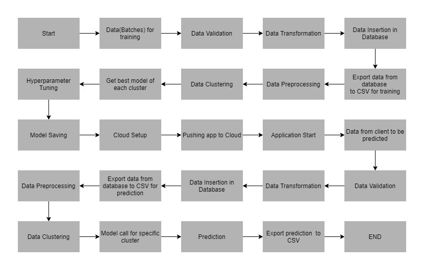

# Thyroid-Detection
## Problem Statement
To build a classification methodology to predict the type of Thyroid based on the given training data.

## Architecture

## Data Description
The client will send data in multiple sets of files in batches at a given location. Data will contain different classes of thyroid and 30 columns of different values.
"Class" column will have four unique values “negative, compensated_hypothyroid,
primary_hypothyroid, secondary_hypothyroid”.
Apart from training files, we also require a "schema" file from the client, which contains all the relevant information about the training files such as:
Name of the files, Length of Date value in FileName, Length of Time value in FileName, Number of Columns, Name of the Columns, and their datatype.

## Data Validation 
In this step, we perform different sets of validation on the given set of training files.  
1.	 Name Validation
2.	 Number of Columns
3.	 Name of Columns
4.	 The datatype of columns
5.	 Null values in columns

## Data Insertion in Database 
1) Database Creation and connection - Create a database with the given name passed. If the database is already created, open the connection to the database. 
2) Table creation in the database - Table with name 
3) Insertion of files in the table

## Model Training 
1) Data Export from Db
2) Data Preprocessing   
   a) Drop columns not useful for training the model. Such columns were selected while doing the EDA.
   b) Replace the invalid values with numpy “nan” so we can use imputer on such values.
   c) Encode the categorical values
   d) Check for null values in the columns. If present, impute the null values using the KNN imputer.
   e)  After imputing, handle the imbalanced dataset by using RandomOverSampler.
3) Clustering - KMeans algorithm is used to create clusters in the preprocessed data. The optimum number of clusters is selected by plotting the elbow plot, and for the dynamic selection of the number of clusters, we are using "KneeLocator" function. The idea behind clustering is to implement different algorithms
   To train data in different clusters. The Kmeans model is trained over preprocessed data and the model is saved for further use in prediction.
4) Model Selection - After clusters are created, we find the best model for each cluster. We are using two algorithms, "Random Forest" and "KNN". For each cluster, both the algorithms are passed with the best parameters derived from GridSearch. We calculate the AUC scores for both models and select the model with the best score. Similarly, the model is selected for each cluster. All the models for every cluster are saved for use in prediction. 

## Prediction Data Description
Client will send the data in multiple set of files in batches at a given location. Apart from prediction files, we also require a "schema" file from client which contains all the relevant information about the training files such as:Name of the files, Length of Date value in FileName, Length of Time value in FileName, Number of Columns, Name of the Columns and their datatype.

## Data Validation - For Prediction Data
In this step, we perform different sets of validation on the given set of training files.  
1.	 Name Validation
2.	 Number of Columns
3.	 Name of Columns
4.	 The datatype of columns
5.	 Null values in columns

## Data Insertion in Database - For Prediction Data
1) Database Creation and connection - Create a database with the given name passed. If the database is already created, open the connection to the database. 
2) Table creation in the database - Table with name 
3) Insertion of files in the table

## Prediction 
 
1) Data Export from Db
2) Data Preprocessing   
   a) Drop columns not useful for training the model. Such columns were selected while doing the EDA.
   b) Replace the invalid values with numpy “nan” so we can use imputer on such values.
   c) Encode the categorical values
   d) Check for null values in the columns. If present, impute the null values using the KNN imputer.
3) Clustering - KMeans model created during training is loaded, and clusters for the preprocessed prediction data is predicted.
4) Prediction - Based on the cluster number, the respective model is loaded and is used to predict the data for that cluster.
5) Once the prediction is made for all the clusters, the predictions along with the original names before label encoder are saved in a CSV file at a given location and the location is returned to the client.

## Deployment
We will be deploying the model to the any Cloud Based Service Platform for example, AWS, Azure, GCP, Heroku or Pivotal Web Services. 
This is a workflow diagram for the prediction of using the trained model.                 

